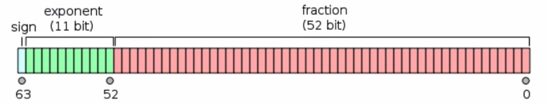

# Tipos de Dados

Os tipos de dados na linguagem JavaScript se dividem em `primitivos` e `objetos`.

Os `primitivos` são imutáveis, ou seja, seu valor não é alterado ao longo do tempo, são eles:

- number
- string
- boolean
- symbol
- object
- undefined

Os `objetos` são valores que representam uma referência em `memória` que pode ser alterada.

 

## Number

O tipo Number é primitivo, imutável e é representado internamente pelo padrão `IEEE 754` de 64 bits. E "representado" quer dizer a forma que ele é tratado/armazenado em memória.

Suporta os sistemas de numeração `decimal, hexadecimal, binário e octal`.

- decimal: o sistema de numeração `decimal`, de `base 10`, deve iniciar com um número de 1 a 9, seguido por números de 0 a 9 com ou sem ponto, indicando se é inteiro ou decimal;

- hexadecimal: o sistema de numeração `hexadecimal`, de `base 16`, deve iniciar com 0x ou 0X, seguido por números de 0 a 9 e letras de A a F;

- binário: o sistema de numeração `binário`, de `base 2`, deve iniciar com 0b ou 0B, seguido por números de 0 a 1;

- octal: o sistema de numeração `octal`, de `base 8`, deve iniciar c om 0, 0o ou 0O, seguido por números de 0 a 7.

 

| decimal | hexadecimal | binário | octal |
| ------- | ----------- | ------- | ----- |
| 0       | 0           | 000000  | 0     |
| 1       | 1           | 000001  | 1     |
| 2       | 2           | 000010  | 2     |
| 3       | 3           | 000011  | 3     |
| 4       | 4           | 000100  | 4     |
| 5       | 5           | 000101  | 5     |
| 6       | 6           | 000110  | 6     |
| 7       | 7           | 000111  | 7     |
| 8       | 8           | 001000  | 10    |
| 9       | 9           | 001001  | 11    |
| 10      | A           | 001010  | 12    |
| 11      | B           | 001011  | 13    |
| 12      | C           | 001100  | 14    |
| 13      | D           | 001101  | 15    |
| 14      | E           | 001110  | 16    |
| 15      | F           | 001111  | 17    |
| 16      | 10          | 010000  | 20    |
| 17      | 11          | 010001  | 21    |
| 18      | 12          | 010011  | 22    |
| 19      | 13          | 010011  | 23    |
| 20      | 14          | 010100  | 24    |
| 21      | 15          | 010101  | 25    |
| 22      | 16          | 010110  | 26    |
| 23      | 17          | 010111  | 27    |
| 24      | 18          | 011000  | 30    |
| 25      | 19          | 011001  | 31    |
| 26      | 1A          | 011010  | 32    |
| 27      | 1B          | 011011  | 33    |
| 28      | 1C          | 011100  | 34    |
| 29      | 1D          | 011101  | 35    |
| 30      | 1E          | 011110  | 36    |
| 31      | 1F          | 011111  | 37    |
| 32      | 20          | 100000  | 40    |

 

Os métodos `toExponential, toFixed e toPrecision` podem ser utilizados para `mudar a forma que o número é representado`.

 

### Operadores Numéricos

- operadores aritméticos: `+, -, *, / e %`;

- operadores de atribuição: `+=, -=, *=, /= e %=`;

- operadores de incremento e decremento: `++ e --`;

- operadores binários: `|, &, ^, ~, <<, >> e >>>`.

 

Obs: cuidado para nao confundir os operadores binários | e & com os operadores booleanos || e &&.

 

### Conversão Numérica

A forma mais simples de converter um número é por meio da `invocação da função construtora Number`.

Um outro jeito de realizar conversões é por meio dos `operadores numércos`. Mas cuidado, nem todos os operadores numéricos realizam a conversão.

O método `toString` de um número, permite `convertê-lo para qualquer sistema de numeração`, bastando indicar qual é a base desejada.

O método `parseInt`, permite converter uma string para um número. Para isso basta indicar o `número e a sua base`, que caso não seja informada, por padrão é 10.

O método `parseFloat` é um pouco mais específico e converte `apenas números no sistema de numeração decimal`.

 

### IEEE 754

O IEEE 754 é um `padrão de representação numérica` criado em 1985 e adotado por diversas linguagens de programação como o JavaScript, Ruby, Python e Java.

Forma que o número é armazenado:

- 1 bit para o sinal;

- 11 bits para o expoente, indica a ordem de grandeza do número. `toExponential`;

- 52 bits para a fração ou mantissa.

 

`Obs: cuidado com alguns tipos de operações envolvendo números`

 

Ao realizar operações com números decimais, `podem existir resíduos decorrentes de arredondamento`.

`Infinity`, que pode ser positivo ou negativo, `é retornado quando uma operação ultrapassa os limites do tipo number`.

`NaN ou Not a Number`, é retornado quando realizamos uma operação numérica `onde não é possível determinar o resultado`.

 

### Math API

Math é um objeto global que contém `constantes matemáticas e métodos para realização de operações envolvendo números`.

 

Constantes:

- E: E;
- LN2: logaritmo natural de 2;
- LN10: logaritmo natural de 10;
- LOG2E: logaritmo de E na base 2;
- LOG10E: logaritmo de E na base 10;
- PI: PI;
- SQRT1_2: raiz quadrada de 1/2;
- SQRT2: raiz quadrada de 2.

 

Operações de arredondamento/sinal:

- abs: converte o sinal do número para positivo;
- ceil: arredonda o número para cima;
- floor: arredonda o número para baixo;
- round: arredonda o número para cima se a parte decimal for de 5 a 9, e para baixo se for de 0 a 4;
- sign: retorna 1 se o número for positivo e -1 se for negativo;
- trunc: elimina a parte decimal do número, tornando-o um inteiro.

 

Operações aritméticas/trigonométricas:

- cbrt: retorna raiz cúbica do número;
- cos: retorna coseno de um ângulo;
- exp: retorna E elevado a um expoente;
- hypot: retorna a raiz quadrada dos quadrados dos números;
- log: retorna o logaritmo do número em base natural;
- pow: retorna o número elevado a um determinado expoente;
- sin: retorna o seno de um ângulo;
- sqrt: retorna a raíz quadrada do número;
- tan: retorna a tangente de um ângulo.

 

|         | 0   | 30     | 45     | 60     | 90  |
| ------- | --- | ------ | ------ | ------ | --- |
| **SEN** | 0   | 0,5000 | 0,7071 | 0,8660 | 1   |
| **COS** | 1   | 0,8660 | 0,7071 | 0,5000 | 0   |
| **TAN** | 0   | 0,5774 | 1      | 1,7321 | -   |

 

Operações de min, max e random:

- min: retorna o menor número passado por parâmetro;
- max: retorna o maior número passado por parâmetro;
- random: retorna um número randômico entre 0 e 1, não incluindo o 1.
